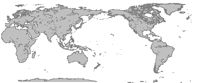
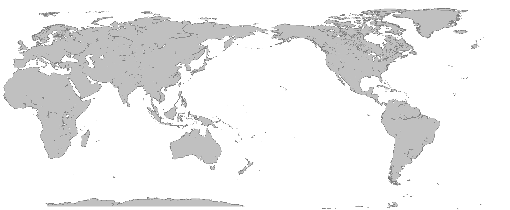

# [ccg-r2d](https://github.com/agdturner/ccg-r2d)
A Java library for rendering 2D Euclidean spatial data using [ccg-v2d](https://github.com/agdturner/ccg-v2d) for vectors and [ccg-grids](https://github.com/agdturner/ccg-grids) for rasters.

This library is being used to help develop [ccg-v2d](https://github.com/agdturner/ccg-v2d). Visualising inputs and outputs of geometrical operationa helps to show that algorithms work. The development of the 2D spatial data libraries helps develop these 3D spatial data libraries: [ccg-v3d](https://github.com/agdturner/ccg-v3d) and [ccg-r3d](https://github.com/agdturner/ccg-r3d). Some example static renderings of data are shown below.

## Triangle rotations, colours and circumcircles

Three rotated overlapping large triangles (one colour for the triangle and a different colour for each respective edge):

Multiple small rotated triangles some overlapping with their circumcircle outlines drawn in white (one colour for all triangles and a different colour for each respective edge:

Triangle rotated 48 times with increasing angle (the last triangle draw has just one colour for it's edge):

Triangle rotated a bit, then the result rotated a bit - 48 times (the last triangle has just one colour for it's edge):

## With grids

A triangle on a couple of randomly coloured grids (one grid underlies the other, the top grid is located in the upper right of the image):

## Triangle intersections

Two rotated triangles with a two triangle intersection:

Two rotated triangles with a four triangle intersection:

## Polygon

Polygon with a polygon internal hole. The external edge of the polygon is coloured red and the edge of the hole is coloured blue:

[GSHHS](https://www.ngdc.noaa.gov/mgg/shorelines/data/gshhg/latest/) low resolution land/sea polygons. The heirarchy is ignored. The image shows lighter for the convex hull and darker for the external edges:

[GSHHS](https://www.ngdc.noaa.gov/mgg/shorelines/data/gshhg/latest/) low resolution land/sea polygons, 165 x 400. (This is shifted a bit compared with the image showing the convex hulls):

[GSHHS](https://www.ngdc.noaa.gov/mgg/shorelines/data/gshhg/latest/) low resolution land/sea polygons, 660 x 1600. (This is shifted a bit compared with the image showing the convex hulls):

## Dependencies
- [Java SE 21](https://en.wikipedia.org/wiki/Java_version_history#Java_SE_21)
- Mainly [ccg-v2d](https://github.com/agdturner/ccg-v2d) for vectors and [ccg-grids](https://github.com/agdturner/ccg-grids) for rasters. Both of thesehave few light weight dependencies.
- Please see the [POM](https://github.com/agdturner/ccg-r2d/blob/master/pom.xml) for details.

## Development plans/ideas
- Calculate and show some example polygon-polygon intersections.
- Create some animations with geometries moving relative to others. 
- Generate some more example renderings of geographical data:
  - [Global Self-Consistent Hierarchical High-Resolution Shoreline (GSHHS) data](https://www.ngdc.noaa.gov/mgg/shorelines/data/gshhg/latest/)
    - [GSHHG-GMT](https://github.com/GenericMappingTools/gshhg-gmt)
  - Surface elevation
  - Land cover
  - Temperature
  - Rainfall
  - National boundaries and human population
- Make a versioned release on Maven Central.
- Investigate ways to speed up rendering.
- Community development:
  - Raise awareness
  - Develop use cases
  - Reach out to GeoSpatial librabry developers ([Apache SIS](https://github.com/apache/sis), [JTS](https://github.com/locationtech/jts), [GeoTools](https://github.com/geotools/geotools)).

## Contributing
- Thanks for thinking about this.
- If this is to form into a collaborative project, it could do with a code of conduct and contributor guidelines based on something like this: [Open Source Guide](https://opensource.guide/) 

## LICENCE
- [APACHE LICENSE, VERSION 2.0](https://www.apache.org/licenses/LICENSE-2.0)
- Other licences are possible!

## Acknowledgements and thanks
- The [University of Leeds](http://www.leeds.ac.uk) has indirectly supported this work by employing me over the years and encouraging me to develop the skills necessary to produce this library.
- Thank you Eric for the [BigMath](https://github.com/eobermuhlner/big-math) library.
