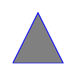
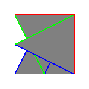
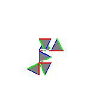
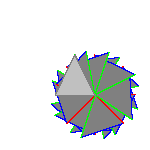
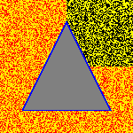
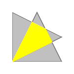

# [ccg-r2d](https://github.com/agdturner/ccg-r2d)
A Java library for rendering 2D Euclidean spatial data built on [ccg-v2d](https://github.com/agdturner/ccg-v2d) and [ccg-grids](https://github.com/agdturner/ccg-grids). There are implementations for double precision and for precision accurate to a specified order of magnitude (which the user can specify).

The first examples are rendering triangles, grids behind triangles, and for showing that the algorithms for intersecting triangles work.

This library has utility for portraying 2D Euclidean spatial data. It is used to help develop [ccg-v2d](https://github.com/agdturner/ccg-v2d) as visualising processed data helps to show that algoithms, like intersection algorithms are working. This helps also in developing [ccg-v3d](https://github.com/agdturner/ccg-v3d) and [ccg-grids](https://github.com/agdturner/ccg-grids) for processing 3D Euclidean spatial data, and [ccg-r3d](https://github.com/agdturner/ccg-r3d) for rendering 3D spatial data. As you may appreciate, 3D Euclidean spatial data rendering is a lot harder than 2D Euclidean spatial data rendering, and getting a simpler and related implementation working can help.

One triangle:

Three rotated overlapping large triangles:

Multiple small rotated triangles some overlapping:

Triangle rotated 48 times with increasing angle:

Triangle rotated a bit, then the result rotated a bit 48 times:

A triangle on a couple of randomly coloured grids:

Two rotated triangles with a two triangle intersection

Two rotated triangles with a four triangle intersection:

