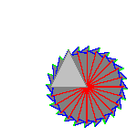

# [ccg-r2d](https://github.com/agdturner/ccg-r2d)
A Java library for rendering 2D Euclidean spatial data using [ccg-v2d](https://github.com/agdturner/ccg-v2d) for vectors and [ccg-grids](https://github.com/agdturner/ccg-grids) for rasters.

Example static renderings of data are shown below.

This library is being used to help develop [ccg-v2d](https://github.com/agdturner/ccg-v2d). Visualising inputs and outputs of geometrical operationa helps to show that algorithms work.

The development of these 2D spatial data libraries helps develop these 3D spatial data libraries: [ccg-v3d](https://github.com/agdturner/ccg-v3d) and [ccg-r3d](https://github.com/agdturner/ccg-r3d).

## Triangle rotations, colours and circumcircles

One triangle (one colour for the triangle and another for it's edge):
- 

Three rotated overlapping large triangles (one colour for the triangle and a different colour for each respective edge):
- 

Multiple small rotated triangles some overlapping with their circumcircle outlines drawn in white (one colour for all triangles and generally a different colour for each respective edge:
- 

Triangle rotated 48 times with increasing angle (the last triangle draw has just one colour for it's edge):

Triangle rotated a bit, then the result rotated a bit 48 times (the last triangle has just one colour for it's edge):

## With grids

A triangle on a couple of randomly coloured grids:

## Triangle intersections

Two rotated triangles with a two triangle intersection

Two rotated triangles with a four triangle intersection:

## Polygon

Polygon that is not a convex hull with a darker outline

Polygon that is not a convex hull with a darker outline and with a polygonal hole

Polygon that is not a convex hull with a darker outline and with a polygonal hole with the external edge coloured red and the internal edge coloured blue

GSHHS low resolution land/sea polygons. The heirarchy is ignored. The image shows lighter for the convex hull and darker for the external edges.

## Development plans/ideas
- Generate some more example renderings of geographical data.
  - [Global Self-Consistent Hierarchical High-Resolution Shoreline (GSHHS) data](https://www.ngdc.noaa.gov/mgg/shorelines/data/gshhg/latest/)
    - [GSHHG-GMT](https://github.com/GenericMappingTools/gshhg-gmt)
  - Surface elevation
  - Land cover
  - Temperature
  - Rainfall
  - National boundaries and human population
- Make a versioned release on Maven Central.
- Investigate ways to speed up rendering.

## Contributions welcome
- Please submit issues.

## LICENSE
- [APACHE LICENSE, VERSION 2.0](https://www.apache.org/licenses/LICENSE-2.0)

## Acknowledgements and thanks
- The [University of Leeds](http://www.leeds.ac.uk) and some externally funded research grants have supported the development of libraries dependencies.
- Thank you Eric for the [BigMath](https://github.com/eobermuhlner/big-math) library.
